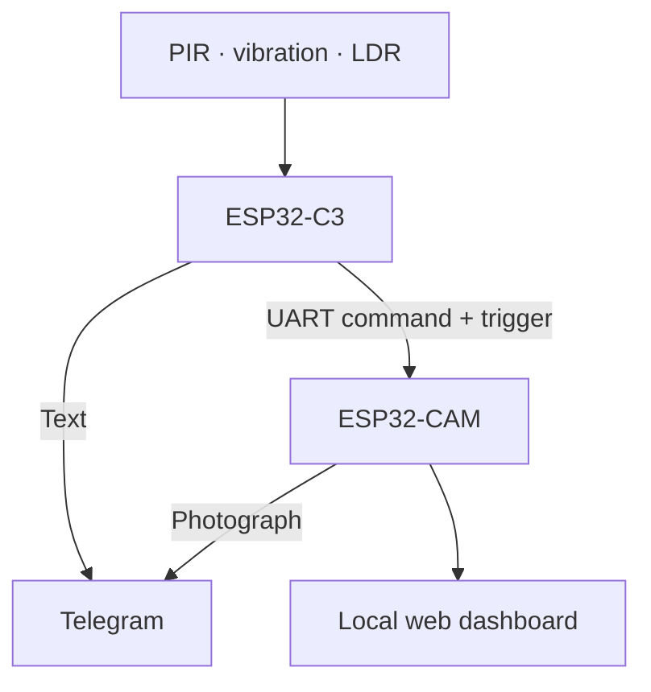
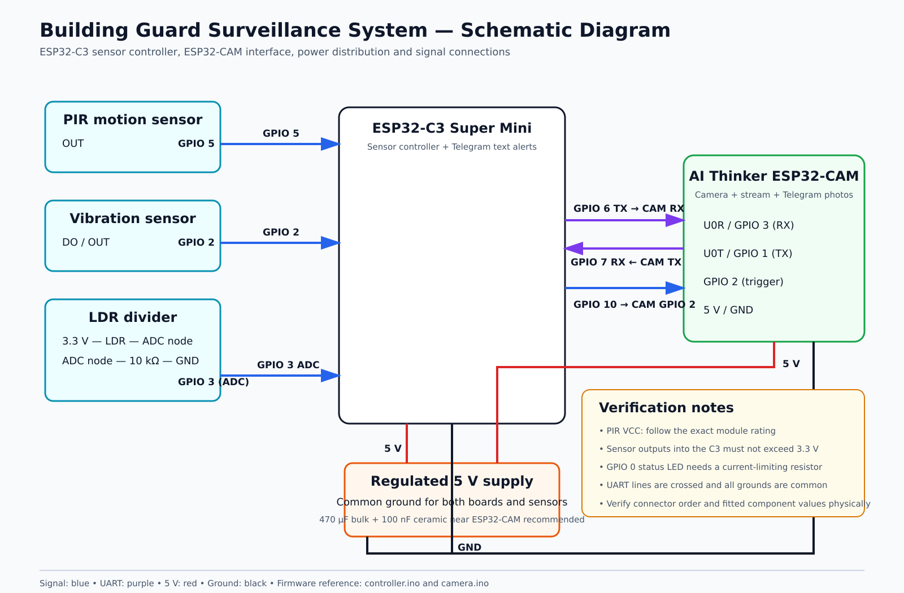

# Building Guard
## Embedded surveillance and tamper monitoring

Building Guard combines PIR motion sensing, vibration monitoring and light-based obstruction detection with ESP32-CAM image capture and Telegram notifications.

Designed and built by **Abdulhamid Abdulkadir**, Electrical and Electronics Engineering graduate, University of Ilorin. The author reports that the completed prototype was submitted to the university laboratory and is in use there.

## Project status

The Telegram screenshot below documents output from the original prototype. The published firmware is a revised implementation derived from the submitted code. Compilation and hardware regression results for this revision have not yet been recorded. No measured detection accuracy, notification latency or uptime is claimed.

## Architecture

| Subsystem | Responsibility |
| --- | --- |
| ESP32-C3 | Sensor sampling, event qualification, cooldowns and Telegram text alerts |
| ESP32-CAM | Camera capture, Telegram photographs, local streaming and manual capture |
| PIR | Motion indication |
| Vibration sensor | Physical-disturbance indication |
| LDR divider | Light measurement used to infer possible covering |
| UART + digital trigger | Event caption command and additional capture request |

The boards separate sensor and camera workloads. Some network and camera operations are synchronous, so polling intervals are nominal scheduling targets rather than hard real-time guarantees.

## Main functions

- Motion detection through an active-high PIR input.
- Vibration qualification using debounced edges within a time window.
- Possible cover detection using an adaptive light baseline.
- Independent controller cooldowns for each event type.
- Telegram text and photographic notifications over Wi-Fi.
- Local video stream and browser-triggered capture.
- Periodic Wi-Fi reconnection attempts.

## Schematic

[Editable SVG](docs/schematic/building-guard-schematic.svg) · [Original drawing](docs/schematic/original-submitted-schematic.jpg)

The diagram summarizes module connections. Verify physical connector order, module variants and fitted component values against the installed unit.

## Demonstration evidence

The screenshot demonstrates notification output; it is not a detection-accuracy benchmark. A hardware demonstration video and installation photographs remain pending laboratory access.

## Setup

Follow [Setup and commissioning](docs/SETUP.md) for the wiring table, private configuration, separate board builds and local interface. Then execute the [test plan](docs/TEST_PLAN.md) before replacing the deployed firmware.

## Documentation

| Document | Purpose |
| --- | --- |
| [Setup](docs/SETUP.md) | Hardware connections, build workflow and troubleshooting |
| [Engineering notes](docs/ENGINEERING_NOTES.md) | Detection logic, parameters, protocol and design limitations |
| [Validation plan](docs/TEST_PLAN.md) | Test procedures, acceptance criteria and result records |
| [Evidence checklist](docs/EVIDENCE_CHECKLIST.md) | Available evidence and remaining captures |

## Repository structure

- `firmware/controller/`: C3 sketch and configuration template.
- `firmware/camera/`: camera sketch and configuration template.
- `docs/schematic/`: schematic assets.
- `docs/images/`: demonstration evidence.
- `docs/`: engineering documentation.

## Known limitations

- The LDR detects light changes at its location, not lens obstruction directly. Room-light changes may resemble covering; a covered lens with an exposed LDR may be missed.
- The camera has one pending capture slot and an eight-second cooldown. Closely spaced events can replace captions or share one capture.
- Telegram requires internet access. There is no persistent offline event queue.
- TLS certificate verification and web authentication are not implemented. Keep the web interface on a trusted local network.
- No GSM fallback, machine-learning model or remote arm/disarm interface is implemented.

## Next engineering milestones

1. Record reproducible build settings and hardware regression results.
2. Validate concurrent events, UART/trigger interactions and supply integrity.
3. Implement verified TLS, authenticated web access and queued events.
4. Measure false alerts, notification latency and sustained operation.

## Author and license

**Abdulhamid Abdulkadir**  
[GitHub](https://github.com/DevAbdul-web) · [License](LICENSE)
