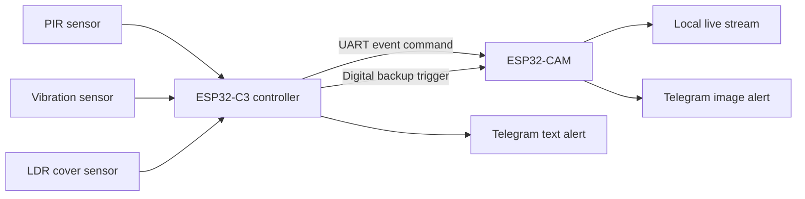
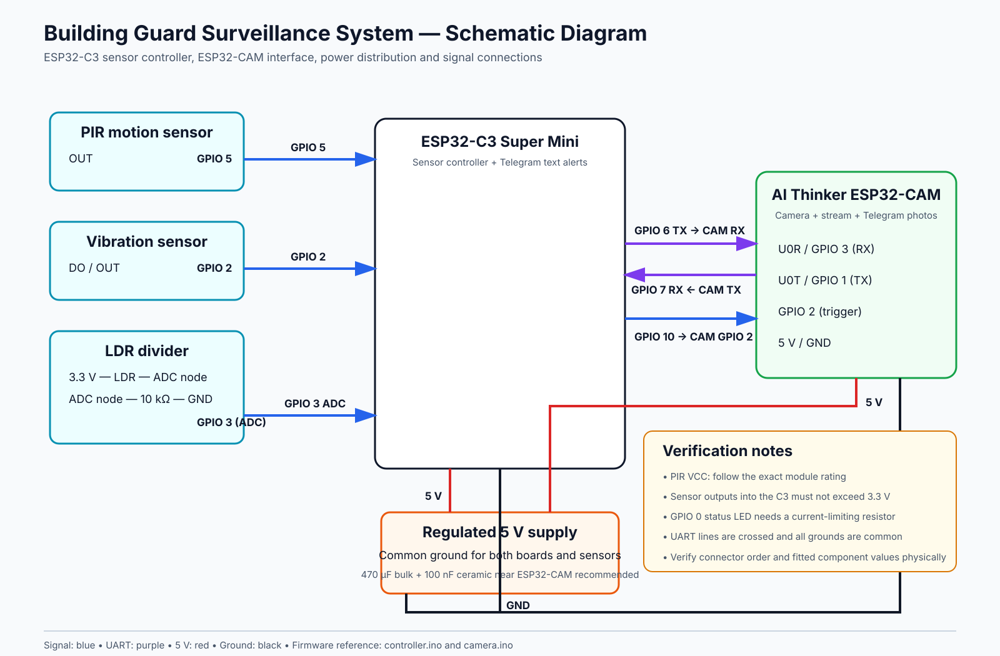
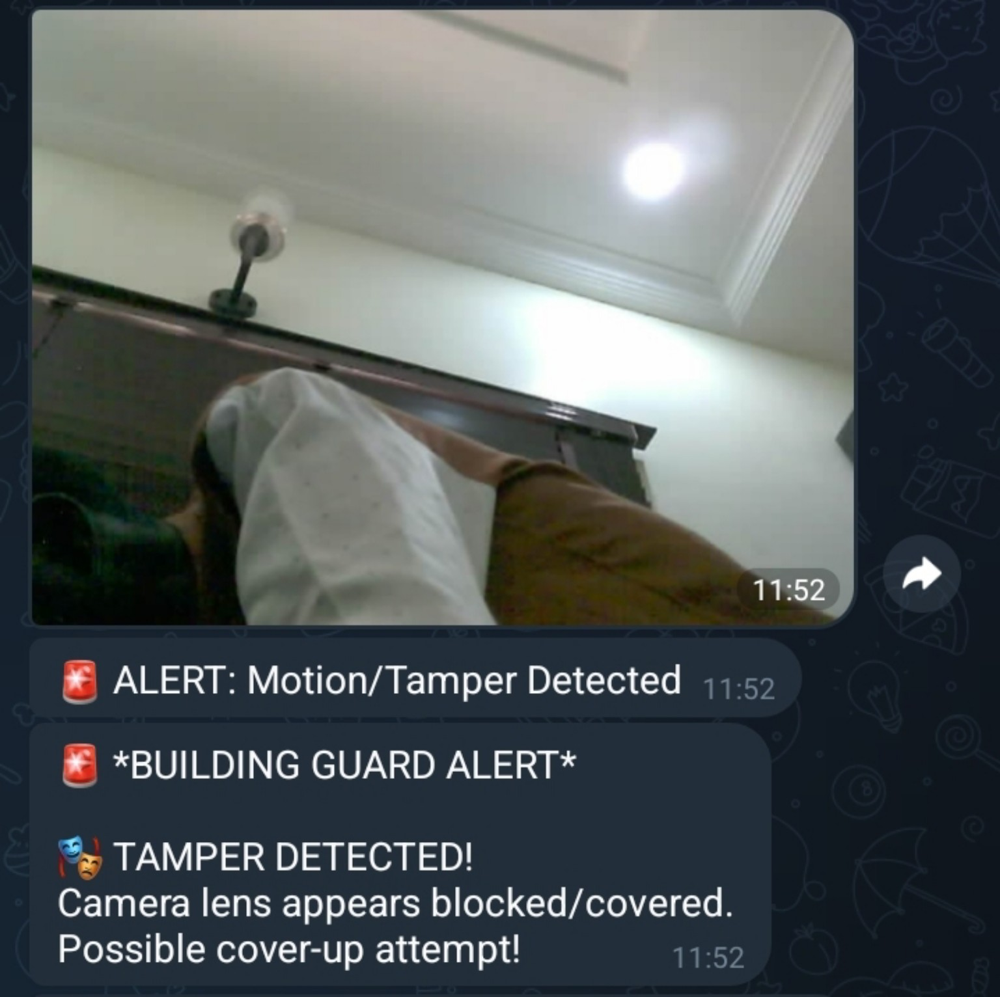

# Building Guard

Multi-sensor surveillance and camera-tamper detection system with real-time Telegram image alerts.

## Overview

Building Guard is an individually developed embedded surveillance system for detecting motion, physical disturbance, and attempts to cover a camera. An ESP32-C3 reads the sensors and classifies events, while an ESP32-CAM captures evidence, provides a local live stream, and sends alert photographs through Telegram.

The completed prototype was submitted to and deployed in a University of Ilorin laboratory. The repository documents the tested system and a security-focused firmware refactor. The refactored revision must be revalidated on the deployed hardware before it replaces the submitted firmware.

The repository includes a verified Telegram lens-cover alert, the original submitted schematic, and a clean schematic diagram derived from the firmware pin assignments.

## Problem

Conventional low-cost cameras may record an incident without warning the owner when the camera is moved, struck, or deliberately covered. Building Guard combines surveillance with independent tamper sensors so that interference with the camera becomes an alert event.

## Verified capabilities

- PIR motion detection
- Interrupt-based vibration sensing with debounce and pulse-window confirmation
- Adaptive LDR baseline for detecting a sudden camera-cover event
- Separate cooldowns for motion, vibration, and cover alerts
- ESP32-C3 to ESP32-CAM command and trigger link
- Automatic JPEG capture after a verified event
- Telegram text and photographic alerts
- Local browser-based live video stream
- Manual image capture from the local dashboard
- Status heartbeat and event-specific LED patterns
- Automatic Wi-Fi reconnection in the refactored controller

## System architecture



## Event logic

### Motion

A PIR event produces a motion alert, requests a camera capture, and starts the motion-specific cooldown.

### Physical tamper

The vibration input is handled by an interrupt. Closely spaced edges caused by contact bounce are rejected, and a tamper event is confirmed only when the configured number of edges occurs inside the evaluation window.

### Camera covering

The controller establishes an ambient-light baseline during startup and updates it slowly as lighting changes. A sudden reduction below a fraction of that baseline is treated as suspicious only when:

1. the normal baseline is bright enough for cover detection to be meaningful;
2. the reduction is large enough; and
3. the condition persists for several consecutive readings.

This relative approach is more robust than using one fixed light threshold for every room.

## Hardware

- ESP32-C3 Super Mini
- AI Thinker ESP32-CAM
- PIR motion sensor
- Digital vibration sensor
- LDR and 10 kOhm voltage-divider resistor
- Status LED
- 5 V regulated supply
- Decoupling components



The original submitted schematic is preserved at [`docs/schematic/original-submitted-schematic.jpg`](docs/schematic/original-submitted-schematic.jpg).

## Repository structure

```text
firmware/
  controller/
    controller.ino
    secrets.example.h
  camera/
    camera.ino
    secrets.example.h
docs/
  images/
  schematic/
  EVIDENCE_CHECKLIST.md
  TEST_PLAN.md
  ENGINEERING_NOTES.md
```

## Configuration

Each firmware directory contains a `secrets.example.h`.

1. Copy it to `secrets.h`.
2. Add the Wi-Fi network, Telegram bot token, and authorized chat ID.
3. Never commit `secrets.h`.
4. Rotate a bot token immediately if it has ever been published.

## Firmware dependencies

Controller:

- WiFi
- WiFiClientSecure
- UniversalTelegramBot
- ArduinoJson

Camera:

- esp32-camera
- WiFi
- WiFiClientSecure
- ESP HTTP Server

## Evidence and current status

The supplied Telegram screenshot shows a real image captured by the ESP32-CAM and a corresponding lens-cover warning. The physical unit remains in the school laboratory, where a full demonstration video will be recorded when access becomes available.



The refactor preserves the tested architecture while improving credential separation and reconnection behavior. See [ENGINEERING_NOTES.md](docs/ENGINEERING_NOTES.md) for the distinction between tested functions and changes awaiting hardware revalidation.

## Testing

The hardware test plan covers:

- motion alert and image delivery;
- confirmed vibration alert;
- sudden lens-cover detection;
- gradual ambient-light change without a false alarm;
- alert cooldown behavior;
- live streaming and manual capture;
- Wi-Fi loss and recovery; and
- controller-to-camera event labeling.

See [TEST_PLAN.md](docs/TEST_PLAN.md).

## Limitations

- Telegram delivery requires Wi-Fi and internet access.
- The live stream is available only on the local network in the submitted implementation.
- `setInsecure()` is retained for compatibility and should be replaced with certificate validation in a production system.
- There is no GSM fallback, cloud event database, AI model, or Telegram command receiver in the verified version.
- The digital trigger is a backup capture request; the UART command carries the event type.

## Future work

- Hardware validation of the refactored firmware
- Non-volatile event queue during internet failure
- Authenticated remote arm and disarm commands
- Secure TLS certificate validation
- Camera-health monitoring
- Local event timestamps and persistent logs
- Enclosure-open switch and backup-power monitoring

## Author

**Abdulhamid Abdulkadir**  
Electrical and Electronics Engineering graduate  
GitHub: [DevAbdul-web](https://github.com/DevAbdul-web)
